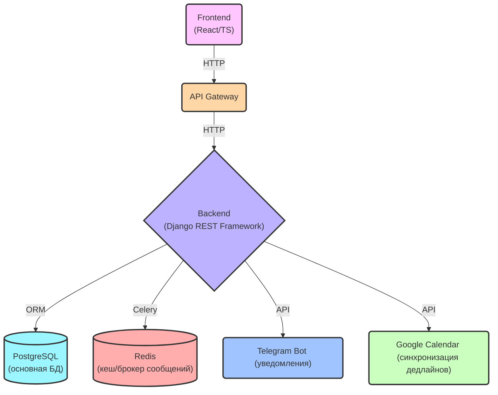

# System Architecture Document: Task Manager с аналитикой и интеграциями 

**Дата:** 2025-07-02
**Версия:** 0.5v
**Автор:** [MindlessMuse666](https://github.com/MindlessMuse666) ([Telegram](https://t.me/mindless_muse "Telegram"), [Email](mindlessmuse.666@gmail.com "Email"))

> _Связанные документы:_
>
> 1. [Схема основной базы данных](../03-database/db-schema.md "Документ: схема основной базы данных")

---

## Описание

Документ описывает архитектуру системы Task Manager: компоненты, взаимодействие, технологии, безопасность и этапы деплоя. Предназначен для архитекторов, аналитиков и разработчиков.

---

## Оглавление

1. [Схема архитектуры системы](#1-схема-архитектуры-системы)
2. [Описание компонентов и технологий](#2-описание-компонентов-и-технологий)
3. [API Endpoints](./api-endpoints.md) — подробное описание всех REST API, примеры запросов и ответов, коды ошибок
4. [Безопасность](#4-безопасность)
5. [Деплой](#5-деплой)

---

## 1. Схема архитектуры системы

## 2. Описание компонентов и технологий

### 2.1. Frontend (React/TS)

- **Фреймворк:** React (TypeScript) - для создания интерактивного и модульного пользовательского интерфейса. TypeScript обеспечивает статическую типизацию, что повышает надежность и упрощает отладку.
- **UI Library:** Tailwind CSS - для быстрой и гибкой стилизации компонентов с использованием utility-first подхода. Рассмотрите использование библиотеки компонентов, например, Material UI или Ant Design, для ускорения разработки и обеспечения консистентного внешнего вида.
- **Графики:** Chart.js - для визуализации данных и создания графиков для дашбордов.
- **State Management:** Zustand - для управления состоянием приложения (более простой и легковесный, чем Redux Toolkit).
- **HTTP Client:** Axios или Fetch API - для выполнения HTTP-запросов к бэкенду.
- **UI Component Documentation:** Storybook - для документирования UI-компонентов и создания living style guide.

### 2.2. API Gateway

- **Технологии:** Django (может отдавать статику).
- **Функциональность:**
  - Маршрутизация запросов к бэкенду.
  - Аутентификация и авторизация (проверка JWT-токенов).
  - Ограничение скорости запросов (Rate Limiting) для защиты от атак.
  - CORS policies (ограничение доменов для фронтенда).
  - CSRF protection (используется "из коробки" Django REST Framework).

### 2.3. Backend (Django REST Framework)

- **Фреймворк:** Django REST Framework - для создания RESTful API. Django обеспечивает ORM (Object-Relational Mapper), что упрощает взаимодействие с базой данных.
- **Асинхронные задачи:** Celery - для выполнения асинхронных задач (например, отправка уведомлений) в фоновом режиме. Redis используется в качестве брокера сообщений для Celery.
- **Аутентификация:** JWT (JSON Web Tokens) - для безопасной аутентификации пользователей.
- **Сериализация:** Django REST Framework Serializers - для преобразования данных между форматами JSON и Python.
- **API Documentation:** OpenAPI (Swagger/ReDoc) - для документирования API и автоматической генерации клиентских библиотек.

### 2.4. Database (PostgreSQL)

- **Технологии:** PostgreSQL - надежная и масштабируемая реляционная база данных.
- **Индексы:** Добавлены индексы для часто запрашиваемых полей (например, user_id в таблице tasks) для повышения производительности запросов.
- **Схема данных (пример):**
  - **users:** id, username, email, password, is_active, is_staff, date_joined.
  - **tasks:** id, user_id, title, description, priority, deadline, status, created_at, updated_at.
  - **tags:** id, name.
  - **task_tags:** task_id, tag_id.

### 2.5. Redis (Cache/Message Broker)

- **Технологии:** Redis - быстрый in-memory data store.
- **Использование:**
  - Кэширование данных для дашбордов и часто запрашиваемых ресурсов.
  - Брокер сообщений для Celery (очередь задач).
  - Хранение сессий пользователей (опционально).
  - Кэширование токенов Google Calendar API.

### 2.6. Telegram Bot API

- **Технологии:** aiogram - асинхронная библиотека для создания Telegram ботов (может быть заменена на telegram-bot-api).
- **Функциональность:** Отправка уведомлений пользователям о новых задачах, приближающихся дедлайнах и изменении статуса задач.
- **Обработка ошибок:** В случае ошибки отправки уведомления (например, из-за лимитов API) - повторные попытки отправки с экспоненциальной задержкой (exponential backoff) и логирование ошибок.

### 2.7. Google Calendar API

- **Технологии:** Google API Client Library.
- **Функциональность:** Синхронизация дедлайнов задач с Google Calendar пользователя. Требует OAuth 2.0 для аутентификации и авторизации.
- **Кэширование токенов:** Кэширование токенов Google Calendar API в Redis для снижения нагрузки на API и ускорения работы.
- **Обработка недоступности API:** В случае недоступности Google Calendar API - кэшировать запросы и повторить синхронизацию через 5 минут.

## 3. API Endpoints

Полное описание всех REST API, примеры запросов и ответов, а также коды ошибок см. в отдельном документе: [API Endpoints](./api-endpoints.md)

### 4. Безопасность

- Все API endpoints должны быть защищены JWT-аутентификацией (кроме endpoints для регистрации и логина).
- Использовать HTTPS для всех соединений.
- Валидировать входные данные для предотвращения атак типа SQL Injection и Cross-Site Scripting (XSS).
- Регулярно обновлять зависимости для устранения известных уязвимостей.
- Rate limiting для защиты от DoS-атак.
- CORS policies (ограничение доменов для фронтенда).
- CSRF protection (используется "из коробки" Django REST Framework).

### 5. Деплой

- **Локально:**

  - Развернуть docker-контейнер (PostgreSQL + Redis + Django) с помощью Docker Desktop или команды `docker-compose up`
  - Пример файла docker-compose см. здесь: [docker-compose.yml](./docker-compose.yml)

- **Production:**
  - Docker
  - Kubernetes (AWS/GCP)
