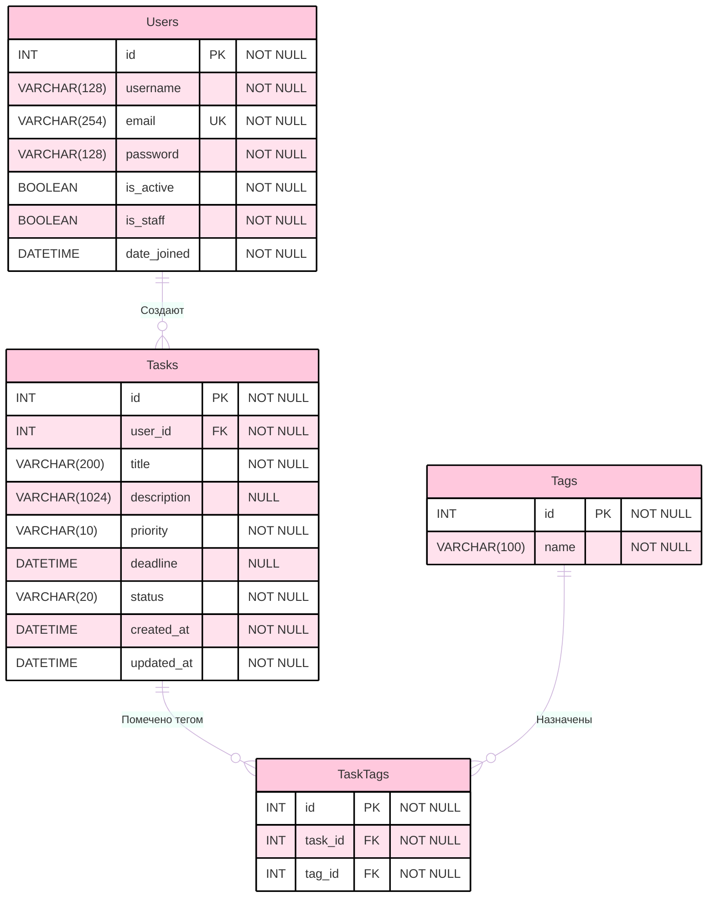

# Database Schema | Схема Базы Данных <a href="https://opensource.org/licenses/MIT"></a>

**Дата:** 2025-07-02
**Версия:** 0.4v
**Автор:** [MindlessMuse666](https://github.com/MindlessMuse666) ([Telegram](https://t.me/mindless_muse "Telegram"), [Email](mindlessmuse.666@gmail.com "Email"))

> _Связанные документы:_
>
> 1. [Vision & Scope системы](../01-business/vision-and-scope.md "Документ: Vision & Scope системы")
> 2. [Архитектура системы](../02-architecture/architecture.md "Документ: архитектура системы")

## 1. ERD (Диаграмма сущностей-связей)



## 2. Описание таблиц

### 2.1. users (хранения информации о пользователях)


### 2.2. tasks (хранения информации о задачах)


### 2.3. tags (хранения информации о тегах)


### 2.4. task_tags (связь между задачами и тегами)


## 3. Миграции (Alembic для Django)

### 3.1. Инициализация (пример создания таблиц)

```python
# migrations/versions/xxxx_initial.py
from alembic import op
import sqlalchemy as sa

def upgrade():
    op.create_table(
        'users',
        sa.Column('id', sa.Integer, primary_key=True),
        sa.Column('username', sa.String(128), nullable=False, unique=True),
        sa.Column('email', sa.String(254), nullable=False, unique=True),
        sa.Column('password', sa.String(128), nullable=False),
        sa.Column('is_active', sa.Boolean, nullable=False, default=True),
        sa.Column('is_staff', sa.Boolean, nullable=False, default=False),
        sa.Column('date_joined', sa.DateTime(), nullable=False),
    )

op.create_table(
    'tasks',
    sa.Column('id', sa.Integer, primary_key=True),
    sa.Column('user_id', sa.Integer, sa.ForeignKey(
        'users.id'), nullable=False),
    sa.Column('title', sa.String(200), nullable=False),
    sa.Column('description', sa.String(1024)),
    sa.Column('priority', sa.String(10),
              nullable=False, server_default='Medium'),
    sa.Column('deadline', sa.DateTime),
    sa.Column('status', sa.String(20), nullable=False, server_default='New'),
    sa.Column('created_at', sa.DateTime(),
              server_default=sa.func.now(), nullable=False),
    sa.Column('updated_at', sa.DateTime(), server_default=sa.func.now(),
              onupdate=sa.func.now(), nullable=False),
)

op.create_table(
    'tags',
    sa.Column('id', sa.Integer, primary_key=True),
    sa.Column('name', sa.String(100), nullable=False, unique=True),
)

op.create_table(
    'task_tags',
    sa.Column('id', sa.Integer, primary_key=True),
    sa.Column('task_id', sa.Integer, sa.ForeignKey(
        'tasks.id'), nullable=False),
    sa.Column('tag_id', sa.Integer, sa.ForeignKey('tags.id'), nullable=False),
)

def downgrade():
    op.drop_table('task_tags')
    op.drop_table('tags')
    op.drop_table('tasks')
    op.drop_table('users')
```

### 3.2. Добавление индексов (пример)

```python
# migrations/versions/zzzz_add_indexes.py
from alembic import op
import sqlalchemy as sa

def upgrade():
    op.create_index('ix_tasks_user_id', 'tasks', ['user_id'])
    op.create_index('ix_tasks_status', 'tasks', ['status'])

def downgrade():
    op.drop_index('ix_tasks_user_id', 'tasks')
    op.drop_index('ix_tasks_status', 'tasks')
```

### 3.4. Как использовать Alembic

1. **Установите Alembic:** `pip install alembic`
2. **Сконфигурируйте Alembic:** `alembic init migrations`
3. **Настройте alembic.ini:** Укажите URL базы данных и путь к директории migrations.
4. **Создайте миграцию:** `alembic revision -m "Initial migration"`
5. **Примените миграции:** `alembic upgrade head`
6. **Откатите миграции:** `alembic downgrade base`

### 3.5. Примечания

- В реальном проекте Alembic конфигурируется через настройки Django, а не напрямую. Используйте библиотеку django-alembic.
- Примеры миграций упрощены для наглядности.

### 3.6. SQL-дамп для инициализации БД (PostgreSQL)

```sql
-- SQL-дамп для инициализации структуры БД Task Manager
CREATE TABLE users (
    id SERIAL PRIMARY KEY,
    username VARCHAR(128) NOT NULL UNIQUE,
    email VARCHAR(254) NOT NULL UNIQUE,
    password VARCHAR(128) NOT NULL,
    is_active BOOLEAN NOT NULL DEFAULT TRUE,
    is_staff BOOLEAN NOT NULL DEFAULT FALSE,
    date_joined TIMESTAMP NOT NULL
);

CREATE TABLE tasks (
    id SERIAL PRIMARY KEY,
    user_id INTEGER NOT NULL REFERENCES users(id),
    title VARCHAR(200) NOT NULL,
    description VARCHAR(1024),
    priority VARCHAR(10) NOT NULL DEFAULT 'Medium',
    deadline TIMESTAMP,
    status VARCHAR(20) NOT NULL DEFAULT 'New',
    created_at TIMESTAMP NOT NULL DEFAULT NOW(),
    updated_at TIMESTAMP NOT NULL DEFAULT NOW()
);

CREATE TABLE tags (
    id SERIAL PRIMARY KEY,
    name VARCHAR(100) NOT NULL UNIQUE
);

CREATE TABLE task_tags (
    id SERIAL PRIMARY KEY,
    task_id INTEGER NOT NULL REFERENCES tasks(id),
    tag_id INTEGER NOT NULL REFERENCES tags(id)
);

-- Индексы для ускорения запросов
CREATE INDEX ix_tasks_user_id ON tasks(user_id);
CREATE INDEX ix_tasks_status ON tasks(status);
```

## 4. Рекомендации

- Используйте Alembic для миграций, а не Django ORM.
- Создавайте миграции для каждого изменения в схеме базы данных.
- Используйте индексы для ускорения запросов.
- Обязательно протестируйте миграции на тестовой базе данных перед применением к production.
