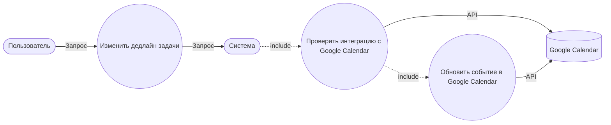
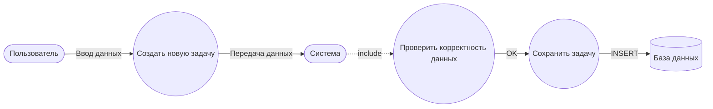
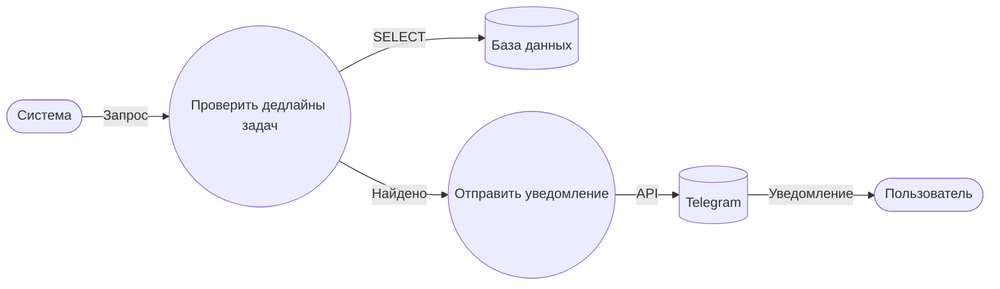
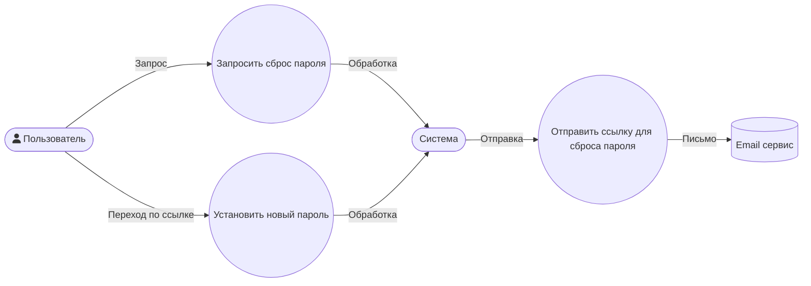

# Use Cases | Кейсы использования 

**Дата:** 2025-07-02
**Версия:** 0.5v
**Автор:** [MindlessMuse666](https://github.com/MindlessMuse666) ([Telegram](https://t.me/mindless_muse "Telegram"), [Email](mindlessmuse.666@gmail.com "Email"))

> _Связанные документы:_
>
> 1. [Vision & Scope системы](../01-business/vision-and-scope.md "Документ: Vision & Scope системы")

---

## Описание

Документ содержит ключевые кейсы использования (Use Cases) для Task Manager: цели, основные и альтернативные потоки, критерии завершения и диаграммы. Предназначен для аналитиков, архитекторов и разработчиков.

---

## Оглавление
1. [Пользовательские кейсы](#1-пользовательские-кейсы)
2. [Системные кейсы](#2-системные-кейсы)

---

## 1. Пользовательские кейсы

### Обновление дедлайна задачи

**Цель:** Пользователь хочет изменить срок выполнения задачи, чтобы актуализировать планирование.

**Основной поток:**

1. Пользователь выбирает задачу и инициирует изменение дедлайна.
2. Система проверяет, настроена ли интеграция с Google Calendar.
3. Если интеграция есть, система обновляет событие в Google Calendar.
4. Новый дедлайн сохраняется в системе.

**Альтернативные потоки:**

- 2a. Интеграция с Google Calendar не настроена — система сохраняет дедлайн только локально.

**Критерии завершения:**

- Дедлайн задачи обновлён в системе (и в Google Calendar, если интеграция есть).

### Создание новой задачи

**Цель:** Пользователь хочет добавить новую задачу для отслеживания работы.

**Основной поток:**

1. Пользователь инициирует создание задачи и вводит данные.
2. Система проверяет корректность данных.
3. При успешной проверке задача сохраняется в базе данных.

**Альтернативные потоки:**

- 2a. Данные некорректны — система сообщает об ошибке, задача не сохраняется.

**Критерии завершения:**

- Новая задача появляется в списке пользователя.

### Получение уведомления о приближающемся дедлайне

**Цель:** Пользователь своевременно получает напоминание о задаче, чтобы не пропустить дедлайн.

**Основной поток:**

1. Система периодически проверяет задачи с дедлайном в ближайшие 24 часа.
2. Система отправляет уведомление пользователю через Telegram.

**Альтернативные потоки:**

- 2a. У пользователя не подключён Telegram — уведомление не отправляется, система логирует событие.

**Критерии завершения:**

- Пользователь получает уведомление о задаче с приближающимся дедлайном.

## 2. Системные кейсы

### Пользователь забыл пароль

**Цель:** Система предоставляет пользователю возможность восстановить доступ к аккаунту, если он забыл пароль.

**Основной поток:**

1. Пользователь нажимает "Забыли пароль" на странице входа.
2. Система отправляет ссылку для сброса пароля на email пользователя.
3. Пользователь переходит по ссылке и устанавливает новый пароль.

**Альтернативные потоки:**

- 2a. Email пользователя некорректен или не существует — система сообщает об ошибке, пользователь не может восстановить пароль.

**Критерии завершения:**

- Пользователь успешно восстановил доступ к аккаунту.

